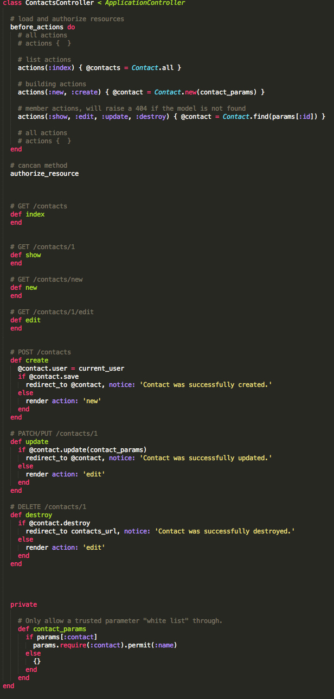
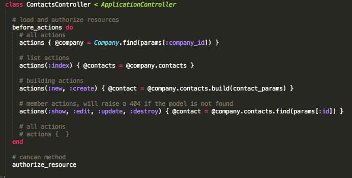

# Before Actions

Organize your controllers by grouping your before and after filters.

## Status

[](http://badge.fury.io/rb/before_actions)
[](https://gemnasium.com/before-actions-gem/before_actions)
[](http://inch-ci.org/github/before-actions-gem/before_actions)


## References

* Home page: https://github.com/before-actions-gem/before_actions
* API Doc: http://rdoc.info/gems/before_actions
* Version: https://rubygems.org/gems/before_actions

## Support

* Bugs/Issues: https://github.com/before-actions-gem/before_actions/issues
* Support: http://stackoverflow.com/questions/tagged/before_actions
* Support/Chat: [](https://gitter.im/before-actions-gem/before_actions)


## Installation

Add this line to your application's Gemfile:

```ruby
gem 'before_actions'
```

And then execute:

```bash
bundle
rails g before_actions:install
```


## Contributing

1. Fork it ( https://github.com/github.com/before-actions-gem/before_actions/fork )
2. Create your feature branch (`git checkout -b my-new-feature`)
3. Commit your changes (`git commit -am 'Add some feature'`)
4. Push to the branch (`git push origin my-new-feature`)
5. Create a new Pull Request

## Versioning

__Before Actions__ uses [Semantic Versioning 2.0.0](http://semver.org)

## Copyright

Copyright 2013-2014 James Pinto – Released under [MIT License](http://www.opensource.org/licenses/MIT)


## Demo

Check this gem in use: [app/controllers/contacts_controller.rb](https://github.com/before-actions-gem/before_actions/blob/master/readme_images/contacts_controller.rb)

```ruby
class ContactsController < ApplicationController

  # load and authorize resources
  before_actions do
    # all actions
    # actions {  }

    # list actions
    actions(:index) { @contacts = Contact.all }

    # building actions
    actions(:new)    { @contact = Contact.new }
    actions(:create) { @contact = Contact.new(contact_params) }

    # member actions, will raise a 404 if the model is not found
    actions(:show, :edit, :update, :destroy) { @contact = Contact.find(params[:id]) }

    # all actions
    # actions {  }
  end

  ...

  def contact_params
    params.require(:contact).permit(:name)
  end
end
```

#### Demo Resource



#### Demo Nested Resource




