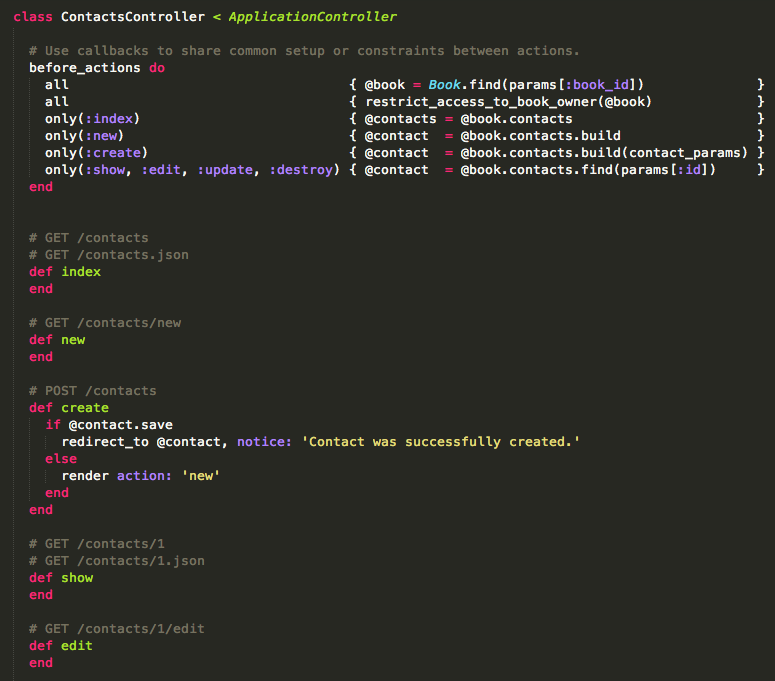

# Before Actions

[](http://badge.fury.io/rb/before_actions)
[](https://gemnasium.com/before-actions-gem/before_actions)
[](https://codeclimate.com/github/before-actions-gem/before_actions)
[](https://github.com/before-actions-gem/before_actions/blob/master/LICENSE.md)


Organize your controllers by grouping your before and after filters.

#### Ruby

Our tests cases run with __1.9.3__, __2.0.0__ and __2.1.0__

We encourage you to work with any __1.9+__ Ruby version

#### Rails

You can use this gem with Rails __3.1__, __3.2__ and __4+__


## Installation

Add this line to your application's Gemfile:

```ruby
gem 'before_actions'
```

And then execute:

```bash
bundle
```

If you want your scaffold generated code to always look like this, just run:

```bash
rails g before_actions:template
```

## Upgrading from v1.*

If you were already using this gem in your project and want to upgrade it, simply run:


```bash
bundle update before_actions
rails g before_actions:template
```

Then simply adjust your controllers to the new syntax


## Demo

#### Restful


#### Nested



#### Sample Code

```ruby
class ContactsController < ApplicationController

  # load and authorize resources
  before_actions do
    # listing actions
    only(:index) { @contacts = Contact.all }

    # building actions
    only(:new)    { @contact = Contact.new }
    only(:create) { @contact = Contact.new(contact_params) }

    # member actions, will raise a 404 if the model is not found
    only(:show, :edit, :update, :destroy) { @contact = Contact.find(params[:id]) }
  end

  after_actions do
    all { your_code_here }
    except(:index) { your_code_here }
  end


  around_actions do
    only(:create) do |controller, action|
      your_code
      action.call
      in_here
    end
  end

end
```


## References

* Home page: https://github.com/before-actions-gem/before_actions
* Trello Board: https://trello.com/b/PMRfJAqq/before-actions-gem
* Bugs/Issues: https://github.com/before-actions-gem/before_actions/issues


## Contributing

1. Fork it ( https://github.com/github.com/before-actions-gem/before_actions/fork )
2. Create your feature branch (`git checkout -b my-new-feature`)
3. Commit your changes (`git commit -am 'Add some feature'`)
4. Push to the branch (`git push origin my-new-feature`)
5. Create a new Pull Request

## Versioning

__Before Actions__ uses [Semantic Versioning 2.0.0](http://semver.org)
